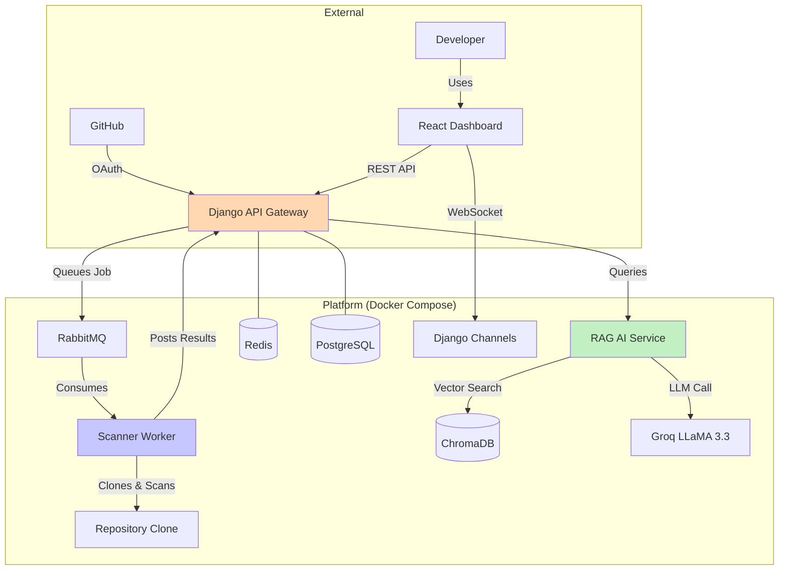

# SecurED-Hub: AI-Powered DevSecOps Orchestration Platform

[](https://www.djangoproject.com/)
[](https://reactjs.org/)
[](https://www.docker.com/)
[](LICENSE)

**A production-ready, multi-tenant platform that automates code security scanning and provides AI-generated remediation through a contextual chat assistant.**

---

## 📋 Table of Contents
- [✨ Features](#-features)
- [🎯 Why This Project?](#-why-this-project)
- [🏗️ System Architecture](#️-system-architecture)
- [📦 Tech Stack](#-tech-stack)
- [🚀 Getting Started](#-getting-started)
- [🐳 Deployment](#-deployment)
- [🧪 Testing & Demo](#-testing--demo)
- [📁 Project Structure](#-project-structure)
- [🤝 Contributing](#-contributing)
- [📄 License](#-license)

---

## ✨ Features

### For Security Teams & Admins
- **Multi-tenancy & Isolation**: Secure separation of data and scans between organizations
- **Centralized Dashboard**: Oversee all repositories, scans, and vulnerability trends
- **Access Control**: Invite-based tenant and developer management with role-based permissions
- **Worker Monitoring**: Real-time visibility into scan worker health and queue status

### For Developers
- **One-Click Security Scans**: Trigger SAST and secret scans via manual trigger or automated workflows
- **Contextual AI Chat Assistant**: Discuss findings in a dedicated chat interface powered by RAG that understands your specific codebase
- **Repository Management**: GitHub OAuth integration for seamless repository connections
- **Real-Time Notifications**: Live updates on scan progress, results, and team activities via WebSockets

### For the Platform (Technical Highlights)
- **Event-Driven Microservices**: Async job orchestration with Celery & RabbitMQ
- **Containerized Scanners**: Each scan runs in an isolated, ephemeral workspace environment
- **RAG-Powered AI Service**: Retrieves context from OWASP/CWE knowledge base and code findings to generate tailored fixes
- **Real-Time Updates**: Live scan progress and notifications via WebSockets (Django Channels)
- **Persistent Vector Store**: ChromaDB with sentence transformers for intelligent knowledge retrieval

---

## 🎯 Why This Project?

This project moves beyond being a simple "scanner wrapper." It demonstrates how to build a **scalable internal platform** that solves real organizational problems:

- **Problem**: Security tools generate noisy, hard-to-understand alerts that developers ignore
- **Solution**: An integrated system that not only finds issues but provides **contextual, AI-generated fixes** within the developer's workflow, drastically reducing remediation time
- **Showcase**: The architecture reflects production-grade concerns: multi-tenancy, async processing, service isolation, secure credential handling, and meaningful AI integration

**Key differentiators:**
- **Multi-tenant architecture** with proper data isolation and RBAC
- **Hybrid AI approach**: Combines public security knowledge (OWASP, CWE, Bandit) with private code context
- **Production-ready patterns**: JWT authentication, token blacklisting, invite workflows, soft-delete mechanisms
- **Real-world scanning**: Bandit for Python SAST, regex-based secret detection with false-positive filtering
- **Microservices done right**: Clear separation of concerns with API gateway, worker services, and AI backend

---

## 🏗️ System Architecture



### Architecture Components

- **API Gateway (Django)**: Handles authentication (JWT), tenant management, repository CRUD, scan orchestration, and real-time notifications
- **Scanner Worker (Celery)**: Isolated service that clones repositories and runs security tools (Bandit for Python SAST, custom secret scanner)
- **RAG AI Service (FastAPI)**: Microservice providing intelligent vulnerability analysis by combining security knowledge bases with code context
- **Message Queue (RabbitMQ)**: Asynchronous job distribution for scalable scan processing
- **Real-time Layer**: WebSockets (Django Channels with Redis backend) for live scan updates and notifications
- **Vector Store (ChromaDB)**: Semantic search over OWASP, CWE, and Bandit documentation for contextual AI responses

---

## 📦 Tech Stack

| Layer | Technology | Purpose |
|:---|:---|:---|
| **Frontend** | React, Tailwind CSS, Chart.js | Dashboard with real-time scan visualization |
| **Backend (API)** | Django, Django REST Framework, JWT, Channels | Business logic, auth, tenant isolation, WebSockets |
| **Async & Message Queue** | Celery, RabbitMQ, Redis | Background job processing and caching |
| **AI Service** | FastAPI, Sentence-Transformers, ChromaDB, Groq | RAG pipeline with LLaMA 3.3-70B for intelligent responses |
| **Security Scanners** | Bandit (SAST), Custom Regex (Secrets) | Python vulnerability detection and secret scanning |
| **Database** | PostgreSQL | Structured data with multi-tenant isolation |
| **Infrastructure** | Docker, Docker Compose | Containerization for local development |
| **Deployment** | Render (Backend), Vercel (Frontend), Supabase (DB) | Cloud hosting with managed services |

---

## 🚀 Getting Started

### Prerequisites
- Docker & Docker Compose
- Git
- GitHub Personal Access Token (for private repository scans)
- Groq API Key (for AI assistant - free tier available)

### Local Development

1. **Clone and configure:**
   ```bash
   git clone https://github.com/yourusername/secured-hub.git
   cd secured-hub
   cp infra/.env.example infra/.env
   # Edit infra/.env with your credentials
   ```

2. **Configure environment variables:**
   ```bash
   # infra/.env
   GROQ_API_KEY=your_groq_api_key
   GITHUB_CLIENT_ID=your_github_oauth_app_id
   GITHUB_CLIENT_SECRET=your_github_oauth_secret
   DJANGO_SECRET_KEY=your_random_secret_key
   REPOSITORY_ENCRYPTION_KEY=your_32byte_encryption_key
   ```

3. **Launch the platform:**
   ```bash
   cd infra
   docker-compose up --build
   ```

4. **Initialize the database:**
   ```bash
   # In a new terminal
   docker-compose exec api python manage.py migrate
   docker-compose exec api python manage.py createsuperuser
   ```

5. **Ingest security knowledge base (for AI):**
   ```bash
   docker-compose exec rag-worker python scripts/ingest_security_kb.py
   ```

6. **Access the application:**
   - Frontend: http://localhost:5173
   - Django API: http://localhost:8001/api/v1
   - API Documentation: http://localhost:8001/api/docs/
   - RAG Service: http://localhost:8002

---

## 🐳 Deployment

The project is designed for cloud deployment with isolated services:

### Recommended Architecture
1. **Database**: Deploy PostgreSQL on **Supabase** or **Railway**
2. **Backend Services**: 
   - Django API: **Render** Web Service
   - Scanner Worker: **Render** Background Worker
   - RAG Service: **Render** Web Service (or Fly.io)
3. **Frontend**: Deploy React app on **Vercel** or **Netlify**
4. **Message Broker**: **CloudAMQP** (managed RabbitMQ) or **Upstash Redis**
5. **Cache/Sessions**: **Upstash Redis** (supports TLS)

### Environment Variables for Production
Ensure all services have:
- `DATABASE_URL` (PostgreSQL connection string)
- `REDIS_URL` (for caching and Channels)
- `CELERY_BROKER_URL` (RabbitMQ or Redis)
- `FRONTEND_URL` (CORS and OAuth callbacks)
- `GROQ_API_KEY` (AI service)
- `REPOSITORY_ENCRYPTION_KEY` (credential encryption)

See detailed deployment guides in the project documentation.

---

## 🧪 Testing & Demo

### Quick Demo Workflow

1. **Register and Create Tenant:**
   - Request access at `/request-access`
   - Admin approves and sends tenant invite
   - Register with invite token

2. **Connect GitHub:**
   - Navigate to Credentials page
   - Click "Connect GitHub"
   - Authorize OAuth app

3. **Add Repository:**
   - Select connected credential
   - Choose a Python repository
   - Repository is validated automatically

4. **Trigger Security Scan:**
   - Click "Scan" button on repository card
   - Watch real-time progress updates
   - View results when complete

5. **Interact with AI Assistant:**
   - Click "Ask AI" on any finding
   - AI provides contextual remediation with code examples
   - References OWASP/CWE documentation automatically

### Sample AI Interaction

**Finding**: `B105: Hardcoded password string` in `config.py:42`

**AI Assistant Response**:
```
🔒 Security Risk (CWE-798: Hardcoded Credentials)

This is a critical security issue. Hardcoded credentials in source code:
- Are visible in version control history
- Can't be rotated without code changes
- Expose credentials to anyone with code access

Recommended Fix:
Use environment variables for all secrets:

# config.py
import os
DB_PASSWORD = os.getenv("DB_PASSWORD")  # Good practice

Never commit:
DB_PASSWORD = "admin123"  # BAD - hardcoded

References:
- OWASP A02:2021 - Cryptographic Failures
- CWE-798: Use of Hard-coded Credentials
```

---

## 📁 Project Structure

```
secured-hub/
├── backend/                    # Django API Gateway
│   ├── accounts/              # User, tenant, invite management
│   ├── repositories/          # Repository CRUD, GitHub OAuth
│   ├── scans/                 # Scan orchestration, findings
│   ├── notifications/         # Real-time notification system
│   ├── chat/                  # AI assistant chat interface
│   ├── api/                   # API versioning and internal endpoints
│   └── core/                  # Django settings, Celery config
├── scanner_worker/            # Celery worker & scanning logic
│   ├── scanners/              # Bandit, secret scanner implementations
│   ├── utils/                 # Git operations, workspace management
│   └── tasks.py               # Celery task definitions
├── rag_service/               # FastAPI AI service
│   ├── app/
│   │   ├── api/              # Chat endpoints
│   │   ├── llm/              # Groq client, prompt builder
│   │   └── knowledge/         # Vector store, retrieval logic
│   └── scripts/               # Knowledge base ingestion
├── frontend/                  # React dashboard
│   ├── src/
│   │   ├── pages/            # Route components (auth, admin, tenant, dev)
│   │   ├── components/        # Reusable UI components
│   │   ├── context/          # Auth, notification contexts
│   │   └── hooks/            # Custom React hooks
└── infra/
    ├── docker-compose.yml     # Local development orchestration
    └── .env.example           # Environment variable template
```

---

## 🤝 Contributing

This is a portfolio project demonstrating production-grade DevSecOps platform architecture. While this is primarily a showcase project, suggestions and issues are welcome.

### Development Guidelines
- Follow existing code style and patterns
- Ensure all tests pass before submitting
- Update documentation for significant changes
- Respect the multi-tenant security model

---

## 📄 License

Distributed under the MIT License. See `LICENSE` for more information.

---

## 🙏 Acknowledgments

- **OWASP** for comprehensive security knowledge base
- **Bandit** for Python SAST capabilities
- **Groq** for fast, free LLM inference
- **Django** and **React** communities for excellent frameworks

---

**Built with ❤️ to demonstrate modern DevSecOps platform architecture**
