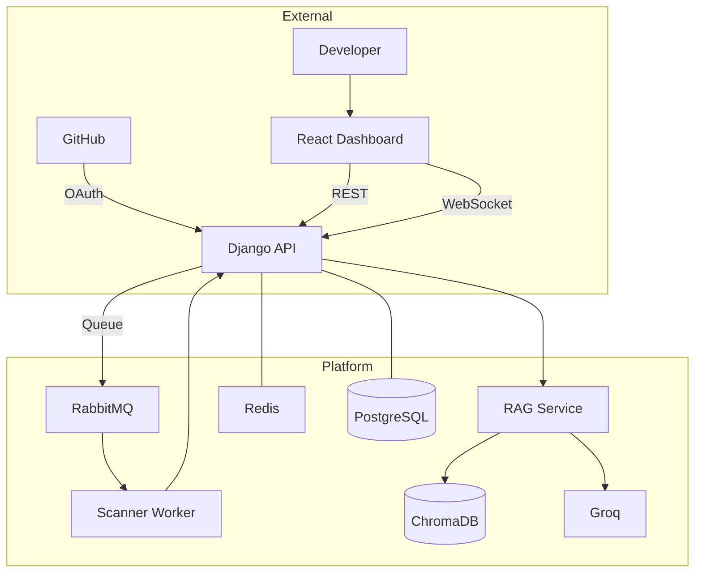

# SecurED-Hub

A multi-tenant DevSecOps platform that scans your code for security issues and helps you fix them with AI-powered remediation.

## What it does

SecurED-Hub connects to your GitHub repositories, runs security scans (SAST, secret detection, dependency checks), and provides an AI chat assistant that explains findings in context and suggests fixes.

### Security Scanning
- **Semgrep** - static analysis for 30+ languages
- **Gitleaks** - finds hardcoded secrets and API keys
- **Trivy** - detects vulnerable dependencies

### Platform Features
- Multi-tenant architecture with proper data isolation
- Real-time scan progress via WebSocket
- GitHub OAuth for repository access
- AI chat powered by RAG (Groq LLaMA 3.3 + ChromaDB)

---

## Architecture



**Components:**
- **Django API** - auth, tenant management, scan orchestration, WebSocket notifications
- **Scanner Worker** - Celery worker that clones repos and runs Semgrep/Gitleaks/Trivy
- **RAG Service** - FastAPI service for AI-powered vulnerability analysis
- **ChromaDB** - vector store for OWASP/CWE knowledge base

---

## Tech Stack

| Layer | Stack |
|:------|:------|
| Frontend | React, Tailwind CSS, Chart.js |
| Backend | Django, DRF, Channels, JWT |
| Workers | Celery, RabbitMQ |
| AI | FastAPI, Sentence-Transformers, ChromaDB, Groq |
| Scanners | Semgrep, Gitleaks, Trivy |
| Database | PostgreSQL, Redis |
| Infra | Docker Compose |

---

## Getting Started

### Prerequisites
- Docker & Docker Compose
- GitHub OAuth app credentials
- Groq API key (free tier works)

### Setup

```bash
# Clone the repo
git clone <your-repo-url>
cd secured-hub

# Configure environment
cp infra/.env.example infra/.env
# Edit infra/.env with your keys

# Start everything
cd infra
docker-compose up --build

# In another terminal - run migrations
docker-compose exec api python manage.py migrate
docker-compose exec api python manage.py createsuperuser

# Load the security knowledge base for AI
docker-compose exec rag-worker python scripts/ingest_security_kb.py
```

### Access
- Frontend: http://localhost:5173
- API: http://localhost:8001/api/v1
- API Docs: http://localhost:8001/api/docs/

---

## How to Use

1. **Get access** - Request access, admin sends invite, register with token
2. **Connect GitHub** - OAuth flow to link your GitHub account
3. **Add repos** - Select which repositories to scan
4. **Scan** - Click scan, watch real-time progress
5. **Review findings** - See vulnerabilities grouped by severity
6. **Ask AI** - Click on any finding to get AI-powered fix suggestions

---

## Project Structure

```
├── backend/                # Django API
│   ├── accounts/          # Users, tenants, invites
│   ├── repositories/      # Repo management, GitHub OAuth
│   ├── scans/             # Scan logic, findings
│   ├── notifications/     # WebSocket notifications
│   ├── chat/              # AI chat interface
│   ├── api/               # API endpoints
│   └── core/              # Settings, config
├── scanner_worker/         # Celery scanner
│   ├── scanners/          # Semgrep, Gitleaks, Trivy
│   ├── utils/             # Git operations
│   └── tasks.py           # Celery tasks
├── rag_service/            # FastAPI AI service
│   ├── app/
│   │   ├── api/           # Endpoints
│   │   ├── llm/           # Groq client
│   │   └── knowledge/     # Vector store
│   └── scripts/           # KB ingestion
├── frontend/               # React app
│   └── src/
│       ├── pages/         # Route components
│       ├── components/    # UI components
│       ├── context/       # React context
│       └── hooks/         # Custom hooks
└── infra/
    └── docker-compose.yml
```

---

## Acknowledgments

- [OWASP](https://owasp.org) - security knowledge base
- [Semgrep](https://semgrep.dev) - static analysis
- [Gitleaks](https://github.com/gitleaks/gitleaks) - secret detection
- [Trivy](https://github.com/aquasecurity/trivy) - vulnerability scanning
- [Groq](https://groq.com) - LLM inference
