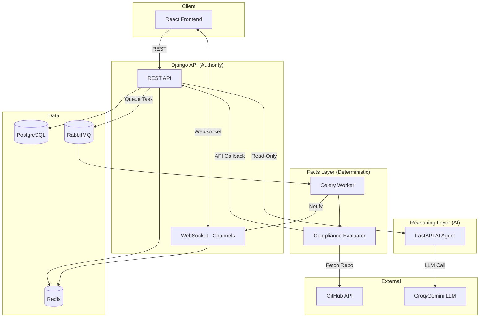
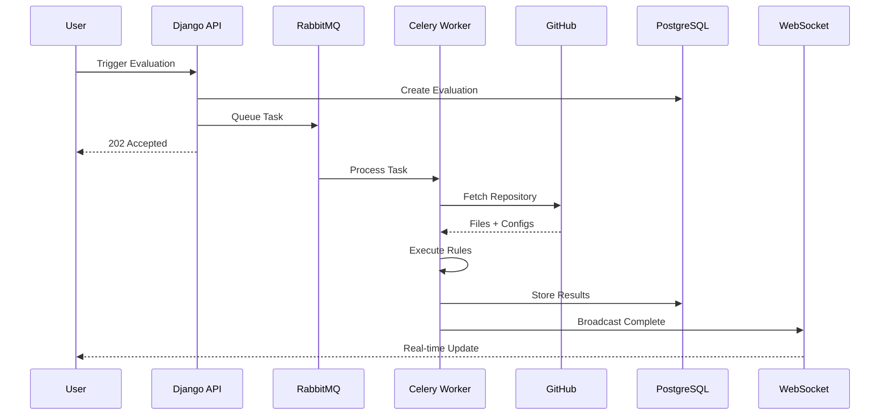
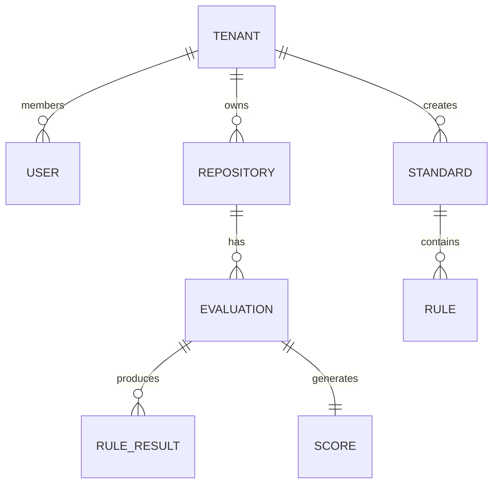

# SecuredHub

A multi-tenant compliance governance platform that helps organizations **measure engineering discipline** against standards aligned with SOC2 and ISO-27001 control principles. Connect your GitHub repositories, define custom compliance rules, and get actionable grades (A-F) with detailed scoring.

> **Note**: This platform evaluates repository hygiene and engineering best practices. It does not provide SOC2/ISO-27001 certification — that requires formal auditor attestation.

## Key Features

- **Multi-Tenancy**: Isolated workspaces for different organizations with role-based access (Owner, Developer)
- **Repository Management**: Connect GitHub repositories via OAuth and manage credentials securely
- **Compliance Evaluation**: Rule-based checks for file structure, configurations, hygiene practices, and security patterns
- **Scoring System**: Weighted compliance scores with letter grades (A-F) per evaluation
- **Real-time Updates**: WebSocket-powered live progress during evaluations
- **AI-Assisted Remediation**: Actionable fix recommendations with SOC2/ISO-27001 control mappings
- **Custom Standards**: Create organization-specific compliance standards beyond built-in rules

## Tech Stack

| Layer | Technology |
|-------|------------|
| **Backend** | Django REST Framework, Daphne (ASGI), Django Channels |
| **Worker** | Celery with RabbitMQ broker |
| **AI Agent** | FastAPI, Groq/Gemini LLM, Pydantic |
| **Frontend** | React 19, Vite, TailwindCSS 4, DaisyUI |
| **Database** | PostgreSQL 15 |
| **Cache/Channels** | Redis (Upstash) |
| **Infrastructure** | Docker Compose |

## Architecture

### System Overview


```mermaid
graph TB
    subgraph Client
        FE[React Frontend]
    end

    subgraph API["Django API (Authority)"]
        DRF[REST API]
        WS[WebSocket - Channels]
    end

    subgraph Facts["Facts Layer (Deterministic)"]
        CELERY[Celery Worker]
        EVAL[Compliance Evaluator]
    end

    subgraph Reasoning["Reasoning Layer (AI)"]
        AGENT[FastAPI AI Agent]
    end

    subgraph Data
        PG[(PostgreSQL)]
        REDIS[(Redis)]
        RMQ[(RabbitMQ)]
    end

    subgraph External
        GH[GitHub API]
        LLM[Groq/Gemini LLM]
    end

    FE -->|REST| DRF
    FE <-->|WebSocket| WS
    DRF --> PG
    DRF --> REDIS
    DRF -->|Queue Task| RMQ
    RMQ --> CELERY
    CELERY --> EVAL
    EVAL -->|Fetch Repo| GH
    EVAL -->|API Callback| DRF
    CELERY -->|Notify| WS
    WS --> REDIS
    DRF -->|Read-Only| AGENT
    AGENT -->|LLM Call| LLM
```

### Compliance Evaluation Flow


```mermaid
sequenceDiagram
    participant U as User
    participant API as Django API
    participant RMQ as RabbitMQ
    participant W as Celery Worker
    participant GH as GitHub
    participant DB as PostgreSQL
    participant WS as WebSocket

    U->>API: Trigger Evaluation
    API->>DB: Create Evaluation
    API->>RMQ: Queue Task
    API-->>U: 202 Accepted

    RMQ->>W: Process Task
    W->>GH: Fetch Repository
    GH-->>W: Files + Configs
    W->>W: Execute Rules
    W->>DB: Store Results
    W->>WS: Broadcast Complete
    WS-->>U: Real-time Update
```

### Data Model


```mermaid
erDiagram
    TENANT ||--o{ USER : members
    TENANT ||--o{ REPOSITORY : owns
    TENANT ||--o{ STANDARD : creates
    REPOSITORY ||--o{ EVALUATION : has
    STANDARD ||--o{ RULE : contains
    EVALUATION ||--o{ RULE_RESULT : produces
    EVALUATION ||--|| SCORE : generates
```

## Project Structure

```
SecuredHub/
├── backend/          # Django REST API + WebSocket
│   ├── accounts/     # User, Tenant, Membership
│   ├── compliance/   # Evaluations, Scores, Results
│   ├── repositories/ # Repos, Credentials, Assignments
│   ├── standards/    # Standards, Rules (with SOC2/ISO mappings)
│   └── api/          # Versioned API routes
├── worker/           # Standalone Celery worker
│   └── compliance/   # Rule engine + GitHub collector
├── ai_agent/         # FastAPI AI assistance service
│   ├── tools/        # Structured AI tools
│   └── knowledge/    # SOC2/ISO control mappings
├── frontend/         # React SPA
└── infra/            # Docker Compose + env
```

## Getting Started

### Prerequisites

- Docker & Docker Compose
- Node.js v18+
- GitHub OAuth App credentials

### Installation

1. Clone the repository:
   ```bash
   git clone https://github.com/ShabasRahman7/SecuredHub.git
   cd SecuredHub
   ```

2. Configure environment:
   ```bash
   cp infra/.env.example infra/.env
   # Edit .env with your credentials
   ```

3. Start backend services:
   ```bash
   cd infra
   docker-compose up -d --build
   ```

4. Run frontend:
   ```bash
   cd frontend
   npm install
   npm run dev
   ```

5. Access the application:
   - Frontend: `http://localhost:5173`
   - API: `http://localhost:8001/api/v1/`
   - API Docs: `http://localhost:8001/api/docs/`

## API Documentation

Interactive API documentation available at `/api/docs/` (Swagger UI) when the backend is running.

## Testing

```bash
# Backend tests (requires Docker)
cd infra && docker-compose exec api pytest

# Worker tests (standalone)
cd worker && pytest -v
```

**Test Coverage**: 160+ tests across 18 test files covering models, views, rule engine, and tenant isolation.

## License

MIT
